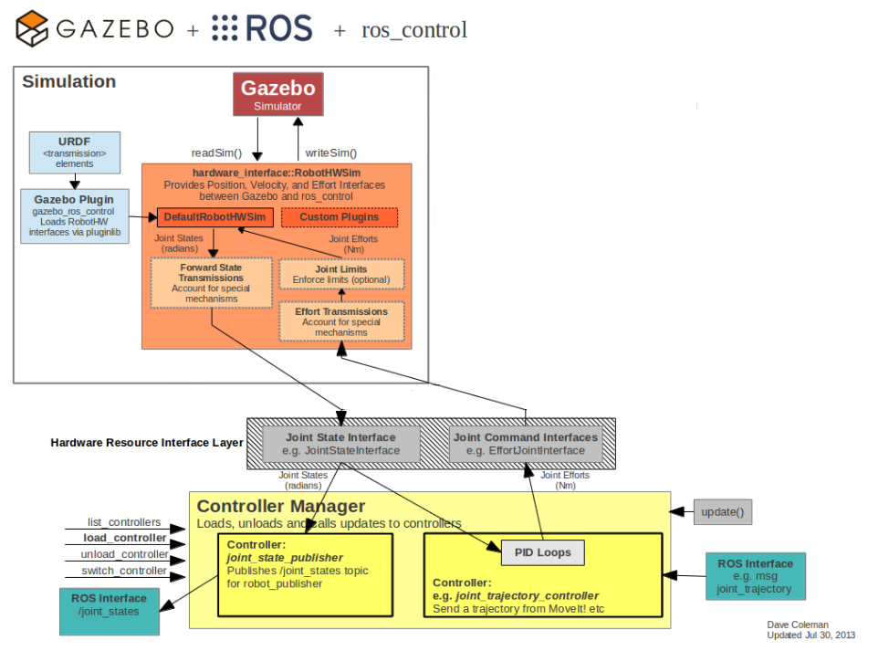

# Custom Gazebo Hardware Interface (Gazebo ros_control Interfaces)
This is a ROS package for integrating the ros_control controller architecture with the [Gazebo](http://gazebosim.org/) simulator.

This package provides a Gazebo plugin which instantiates a ros_control controller manager and connects it to a Gazebo model.

It extends the default plugin available in [gazebo_ros_control](https://github.com/ros-simulation/gazebo_ros_pkgs/tree/indigo-devel/gazebo_ros_control).
This plugin has originally been discussed and proposed [here](https://github.com/ros-simulation/gazebo_ros_pkgs/pull/256).

## Usage
[Documentation](http://gazebosim.org/tutorials?tut=ros_control&cat=connect_ros) related to the default plugin is provided on Gazebo's website.

To use the plugin, add the following to your robot's URDF:

```
  <gazebo>
    <plugin name="gazebo_ros_control" filename="libmy_gazebo_ros_control.so">
      <robotNamespace>/NAMESPACE</robotNamespace>
    </plugin>
  </gazebo>
```
The ```robotNamespace``` is used as a prefix for the ```controller_manager``` instantiated by the plugin.  
The tag is optional and will default to global namespace '/' if not set.  
In the example above the services will be advertised under ```/NAMESPACE/controller_manager```.  
__NOTE__: Do not use a trailing '/' before NAMESPACE!

You can also use the tags ```robotParam``` and ```controlPeriod``` as for the default plugin.

